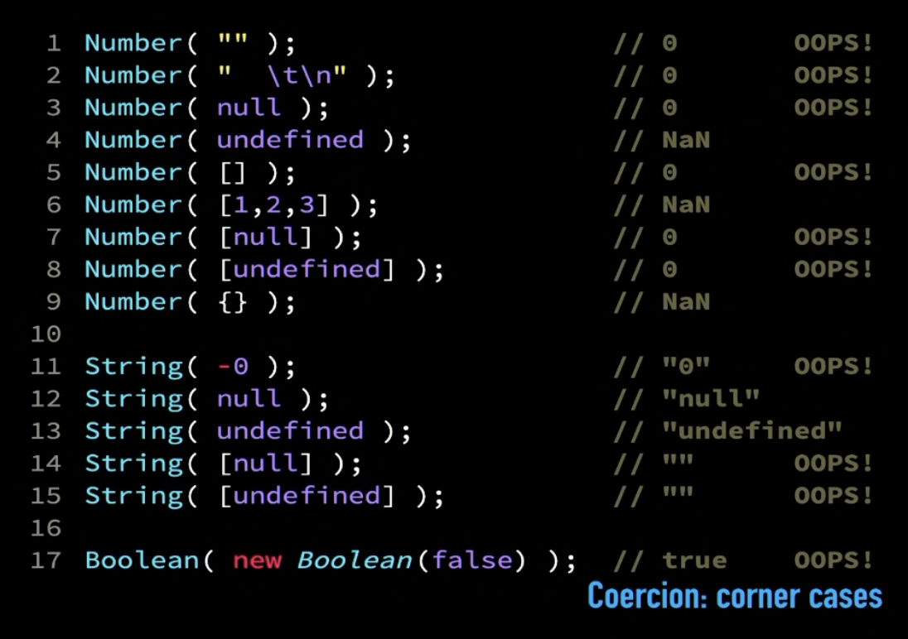

# Types
## ***Important NOTEs:***
- **Never do comparison between values that are non-primitive and primitive. Because it will do coercion using [`ToPrimitive`](#abstract-operations) on non-primitive value. And there are many Caveats with that. It is definite footgun to be triggered.**
- **Always be aware of what types of values you are getting in a function so that we can avoid coercion footguns.**
- **Always design functions that will have specific types of inputs. Use JSDocs and specify types for parameters.**
- **For `==` if both operands are non-primitive values (objects, arrays), `==` does **not** do any coercion.**
- **Use *`a == null`* instead of `a === null && a === undefined`.**

## Types
- In JavaScript and other dynamically typed languages variables do not have types
but values do have types.
- Types are:
    - null
    - undefined
    - number
    - string
    - boolean - true, false
    - Symbol
    - BigInt
    - Object
## `typeof` operator
- `typeof` operator returns string representation of type.
So do **not** use ~~`typeof obj === undefined`~~. It should be `typeof obj === "undefined"`
- but `let v = null; typeof v` returns "object".
- but `let v = []; typeof v` returns "object".
- but `let v = function(){}; typeof v` returns "function".
- `typeof` returns `"undefined"` even for undeclared variables.
- `BigInt` and `number` do not mix well.
## `NaN`
- `NaN` is invalid number. It is not `Not a Number` it is `Invalid Number`
- Conversion of any non-number value (like `string`) in number results in `NaN`.
- Any numeric operation with one of it's operand as `NaN` will always returns `NaN`
- Subtracting `string` from `number` will try to coerce `string` value to `number`
and as it is not a number it will turn the `string` value to `NaN`.
 As said before any operation with `NaN` will return `NaN` so output of subtraction will be `NaN`.
- `NaN` are not equal to each other because of IEEE standard.
So we have JavaScript utility to `Number.isNaN` that can be used to check if value is `NaN`.
- `typeof` `NaN` returns `number`.
- ***NOTE:*** There is another utility `isNaN` (different from `Number.isNaN`) which
should not be used because if we pass string to `isNaN` it returns true.
Because it coerces value passed to it to number and checks if it is `NaN`.
Since `isNaN` shouldn't check the type but it should check if value is `NaN` use `Number.isNaN` (added in ES6).
## Negative Zero
- We can have `-0` value because of IEEE 754 standard.
- JavaScript has weird implementation for `-0`.
 `0 === -0` returns `true`. `-0 < 0 `returns` false`. `-0 > 0 `returns` false`
- But `Object.is` behaves as expected. It is added in ES6.
- `-0` to use for direction in map for still real-life object.
- Any `number` divided by `-0` returns `-Infinity` and if divided by `0` returns `Infinity`.
- e.g.
```javascript
var negZero = -0
negZero === -0 // returns true
negZero === 0 // returns true
Object.is(negZero, 0) //returns false
Object.is(negZero, -0) //returns true
```
## Fundamental Objects
- Use **with** `new` (constructor): `Object()`, `Array()`, `Function()`, `Date()`, `RegExp()`, `Error()`
- Use **without** `new` (constructor): `Number()`, `String()`, `Boolean()`
- `Date` uses 0 based months, i.e. January is 0.

## Type Conversion aka "Coercion"
- If we perform any operation which has requirement of certain type like string concatenation then JavaScript will coerce try to coerce the value in required type. It uses Abstract Operations like `ToPrimitive` for coercion.
- It is better to be explicit about some of the coercion because it will be easier to undefined. We can use `Boolean()`, `String()` or `toString()` and `Number()` to be explicit about coercion.
### Abstract Operations
- [`ToPrimitive(hint)`<sup> 2018](https://262.ecma-international.org/9.0/#sec-toprimitive) - [( latest spec )](https://tc39.es/ecma262/#sec-toprimitive)
    - where `hint` is preferred type. `hint` is a suggestion, `ToPrimitive` is not always going to return value of type `hint`.
    - Generally `hint` is `string` or `number`. `ToPrimitive` is not actual method but conceptual operation defined in spec.
    - `ToPrimitive` is called recursively till we get primitive value. <br>
    - e.g. `valueOf()` -> `hint` is `number`, `toString()` -> `hint` is `string`.
    - If `valueOf()` doesn't return primitive value then `ToPrimitive` calls `toString()`. `valueOf()` returns `this`.
- [`toString()` <sup>2018](https://262.ecma-international.org/9.0/#sec-tostring) - [(latest spec)](https://tc39.es/ecma262/#sec-tostring) - Uses `ToPrimitive(string)` internally.
    It returns string representation.<br>
    - `null` and `undefined` returns `"null"` and `"undefined"`.
    - `[1,2,3]` returns `"1,2,3"`.
    - `{}` returns `[object Object]`<br>
    - ***Caveats***
        - `-0` returns `"0"`
        - `[]` empty array returns `""` empty string.
        - `[null]` array returns `""` empty string.
        - `[undefined]` array returns `""` empty string.
        - `[null, undefined]` returns `","` even though separate `null` and `undefined` returns `"null"` and `"undefined"`.
        - `[[[],[],[]],[]]` returns `",,,"`
        - `[,,,]` returns `",,,"`
        - `{}` returns `[object Object]`
        - `{a:2}` returns `[object Object]`
    - Because of these Caveats do not use `toString()` on arrays.
- [`ToNumber` <sup>2018](https://262.ecma-international.org/9.0/#sec-tonumber) - [(latest spec)](https://tc39.es/ecma262/#sec-tonumber)
    - `ToNumber` uses `ToPrimitive` internally. And as stated before `ToPrimitive`
     tries to do `valueOf()` before and if value is not primitive then does
    `toString()`. Also till primitive is not found recursively calls `valueOf` and `toString`.
    - For Object and Arrays `valueOf()` is not primitive so it first calls
     `toString()` then recursively `ToPrimitive`.
    - `"3.14"` returns 3.14
    - ***Caveats***
        - `"3.1400"` returns 3.14
        - `""` returns `0`
        - `"  \n\t"` also returns `0`
        - `"."` returns `NaN`
        - `null` returns `0`
        - `undefined` returns `NaN`
        - `[""]` returns 0, as it first does `valueOf` which does not return primitive value.
        - `[null]` returns 0, as it first does `valueOf` which does not return primitive value.
        - `[undefined]` returns 0, as it first does `valueOf` which does not return primitive value.
        - `[1,2,3]` returns NaN, as it first does `valueOf` which does not return primitive value.
        Then `toString([1,2,3])` which returns `"1,2,3"` and `ToNumber` of `"1,2,3"` returns NaN.
        - `[[[[[]]]]]` returns 0.
        - `{}` object returns `NaN` as `toString` of object is `[object Object]` which is `NaN`.
        - If we override `valueOf` then we can return whatever we want.
- [`ToBoolean` <sup>2018](https://262.ecma-international.org/9.0/#sec-toboolean) - [(latest spec)](https://tc39.es/ecma262/#sec-toboolean)
    - Return if value is falsy or truthy.
    - It does **not** call `ToPrimitive`.
    - truthy values: any number other than `NaN`, 0, -0,; any string whose length > 0; true; object
    - falsy values: `NaN`, 0 , -0, `""`, false, `undefined`, `null`
    - ***Caveats***
        - `[]` returns `true`
        - `" "` returns `true` because length of string is 1.
### Implicit Coercion
- Template strings does string coercion. Strings with backticks (\`  \`)
- [Binary `+` operator <sup>2018](https://262.ecma-international.org/9.0/#sec-addition-operator-plus-runtime-semantics-evaluation) - [(latest spec)](https://tc39.es/ecma262/#sec-addition-operator-plus) does string coercion if we have one operand `string` and other isn't.
- [Unary `+` operator <sup>2018](https://262.ecma-international.org/9.0/#sec-unary-plus-operator-runtime-semantics-evaluation) - [(latest spec)](https://tc39.es/ecma262/#sec-unary-plus-operator) does number coercion for strings.
- [Binary `-` operator <sup>2018](https://262.ecma-international.org/9.0/#sec-subtraction-operator-minus-runtime-semantics-evaluation) - [(latest spec)](https://tc39.es/ecma262/#sec-subtraction-operator-minus) coerces string to number.
- [Unary `-` operator <sup>2018](https://262.ecma-international.org/9.0/#sec-unary-minus-operator-runtime-semantics-evaluation) - [(latest spec)](https://tc39.es/ecma262/#sec-unary-minus-operator) coerces string to number.
- `if` and `while` do boolean coercion.
- [`>`, `<`  comparison operators](https://262.ecma-international.org/9.0/#sec-abstract-relational-comparison) coerce operands to number if one of the operands is number. [Relational Operators Spec <sup>2018](https://262.ecma-international.org/9.0/#sec-relational-operators) - [(latest spec)](https://tc39.es/ecma262/#sec-relational-operators).
    - If there are 2 strings for > or < the JavaScript performs alpha-numeric comparison.
- If one of the operands is number then `==` coerces other to number as well. **Implicit Number Coercion**
### Boxing
- Coercion of primitive values into Fundamental objects.
- It is example of calling `string.length` even though `string` is primitive value. It first coerces `string` to `String`.
### Equality (==, ===) and Coercion
- [`==` Equality <sup>2018](https://262.ecma-international.org/9.0/#sec-abstract-equality-comparison) - [(latest spec)](https://tc39.es/ecma262/#sec-islooselyequal)
    - `==` prefers number comparison.
    - If types match `==` is same as `===`. (i.e. It internally does same thing).
    - If one of the operands is number then `==` coerces other to number as well. **Implicit Number Coercion**
    - For operands `null` or `undefined` only `null == undefined` returns true, so if any of operands in comparison is `null` or `undefined` it will return false.
    - If one of the operand is primitive and other is not, then it coerces other operand to primitive using `ToPrimitive` abstract operation.
        - And as said before for `ToPrimitive`, it does `valueOf` first and then `toString`.
        - So for any object `ToPrimitive` will perform `valueOf` which returns `this` of object then `toString` i.e. result is `[object Object]`.
        - So `{} == '[object Object]'` returns **true**.
    - If 2 operands are not primitive then it does type check and if types match it runs `===`.
        - If types do not match then it will return false.
- [`===` Strict Equality <sup>2018](https://262.ecma-international.org/9.0/#sec-strict-equality-comparison) - [(latest spec)](https://tc39.es/ecma262/#sec-isstrictlyequal)
    - It checks the types first. If types are not equal then it directly returns false.
    - `null === undefined` returns false as `typeof null` is `"object"` and `typeof undefined` is `"undefined"`
    - `===` returns false for 2 `NaN` and true for `0 === -0`.
    - In case of object if variable refers to same object (reference to same memory) then and only then it returns true.
- Always use equality when you have idea of type of operands.

***Caveats:***
- `42 == [42]` returns **true**.
    - Because whenever we have non-primitive and primitive operands in `==`, JS coerces non-primitive value `[42]` to primitive using `ToPrimitive`.
    - Coercion using `ToPrimitive` is `toString` of `[42]` which results in `"42"`.
    - Whenever there is at least one operand of type `number` in `==` comparison javascript coerces other to `number`.
    - So `ToNumber("42")` returns number `42`.
    - And now we have same type for `42` and **coerced** `42` so `==` does `===` operation.
    - And we get `42` equals `42`, so we get `true`.
- `[] == ![]` returns **true**.
    - Because `![]` returns `false`. Since [!](https://tc39.es/ecma262/#sec-logical-not-operator) will do `ToBoolean` of `[]` which will be true because `[]` is truthy. Then `!true` is `false`.
    - Because whenever we have non-primitive `[]` and primitive boolean `false` operands in `==`, JS coerces non-primitive value `[]` to primitive using `ToPrimitive`.
    - Coercion using `ToPrimitive` is `toString` of `[]` which results in `""`.
    - Types `boolean` and `string` do not match.
    - As `==` prefers numbers the `""` will be coerced to `0`
    - Coercion of `false` to number will be 0.
    - And `0 == 0` is `true`.
    - Root of evil is coercion of `""` to `0` and coercion of `[]` in string to `""` not `"[]"`.
- `[] == true` returns **false**.
    - Because whenever we have non-primitive `[]` and primitive boolean `true` operands in `==`, JS coerces non-primitive value `[]` to primitive using `ToPrimitive`.
    - Coercion using `ToPrimitive` is `toString` of `[]` which results in `""`.
    - Types `boolean` and `string` do not match.
    - As `==` prefers numbers the `""` will be coerced to `0`
    - Coercion of `true` to number will be 1.
    - And `0 == 1` is `false`.
- `[] == false` returns **true**.
    - Opposite of above.

### Corner Cases for Coercion
Screenshot from FrontEndMasters course [Deep JavaScript Foundations, v3](https://frontendmasters.com/courses/deep-javascript-v3/)



